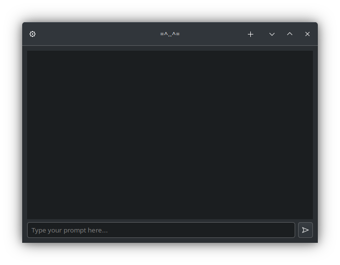

# MeowMeow

**MeowMeow** is a simple wrapper around Groq, built using **GTK 3** for a graphical user interface (GUI).

Inspired by [pbaygtk](https://github.com/aspizu/pbaygtk/).

## Installation

Clone the repository:

```bash
git clone https://github.com/GivenBY/MeowMeow.git
cd MeowMeow
```

## Run

Once installed, you can run the application using:

```bash
python main.py
```

## API Key

Add API Key by pressing the top left setting emblem

## Screenshot


